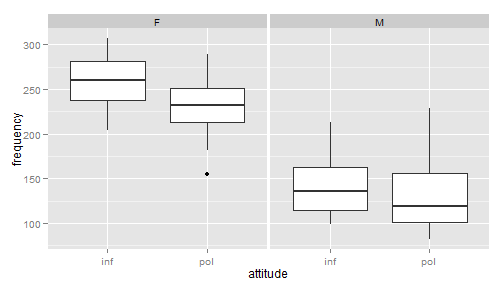

% Hausaufgabe 07
% Anna RYsop <rysop@students.uni-marburg.de>
% 2014-05-11

Falls die Umlaute in dieser und anderen Dateien nicht korrekt dargestellt werden, sollten Sie File > Reopen with Encoding > UTF-8 sofort machen (und auf jeden Fall ohne davor zu speichern), damit die Enkodierung korrekt erkannt wird! 


# Die nächsten Punkte sollten langsam automatisch sein...
1. Kopieren Sie diese Datei in Ihren Ordner (das können Sie innerhalb RStudio machen oder mit Explorer/Finder/usw.) und öffnen Sie die Kopie. Ab diesem Punkt arbeiten Sie mit der Kopie. Die Kopie bitte `hausaufgabe07.Rmd` nennen und nicht `Kopie...`
2. Sie sehen jetzt im Git-Tab, dass der neue Ordner als unbekannt (mit gelbem Fragezeichen) da steht. Geben Sie Git Bescheid, dass Sie die Änderungen im Ordner verfolgen möchten (auf Stage klicken). Die neue Datei steht automatisch da.
3. Machen Sie ein Commit mit den bisherigen Änderungen (schreiben Sie eine sinnvolle Message dazu -- sinnvoll bedeutet nicht unbedingt lang) und danach einen Push.
4. Ersetzen Sie meinen Namen oben mit Ihrem. Klicken auf Stage, um die Änderung zu merken.
5. Ändern Sie das Datum auf heute. (Seien Sie ehrlich! Ich kann das sowieso am Commit sehen.)
6. Sie sehen jetzt, dass es zwei Symbole in der Status-Spalte gibt, eins für den Zustand im *Staging Area* (auch als *Index* bekannt), eins für den Zustand im Vergleich zum Staging Area. Sie haben die Datei modifiziert, eine Änderung in das Staging Area aufgenommen, und danach weitere Änderungen gemacht. Nur Änderungen im Staging Area werden in den Commit aufgenommen.
7. Stellen Sie die letzten Änderungen auch ins Staging Area und machen Sie einen Commit (immer mit sinnvoller Message!).
8. Vergessen Sie nicht am Ende, die Lizenz ggf. zu ändern!


# Verteilung von Noten
An der Uni Marburg nutzen wir 15 Punkte als Benotungskala (*Notenpunkte*). Wir nehmen an, dass der Mittelwert 8 NP (=3 im üblichen 1-5 System, was eigentlich einem durchschnittlichen Verständnis des Stoffes entsprechen soll) ist. Wie sieht dann die Verteilung der Noten aus? Wir müssen uns noch überlegen, was eine sinnvolle Standardabweichung für die Noten wäre. Vielleicht ist am leichtesten, wenn wir einfach ein paar ausprobieren und plotten. Wir fangen mit $sigma = 3,4,5$ an. Das entspricht 1, 1.5, 2 Noten auf der 1-5 Skala.


```r
noten <- 1:15
mu <- 8
drei <- dnorm(noten, mean = mu, sd = 3)
vier <- dnorm(noten, mean = mu, sd = 4)
fuenf <- dnorm(noten, mean = mu, sd = 5)

noten.dist <- data.frame(Notenpunkte = noten, drei, vier, fuenf)
noten.dist
```

```
##    Notenpunkte     drei    vier   fuenf
## 1            1 0.008741 0.02157 0.02995
## 2            2 0.017997 0.03238 0.03884
## 3            3 0.033159 0.04566 0.04839
## 4            4 0.054670 0.06049 0.05794
## 5            5 0.080657 0.07528 0.06664
## 6            6 0.106483 0.08802 0.07365
## 7            7 0.125794 0.09667 0.07821
## 8            8 0.132981 0.09974 0.07979
## 9            9 0.125794 0.09667 0.07821
## 10          10 0.106483 0.08802 0.07365
## 11          11 0.080657 0.07528 0.06664
## 12          12 0.054670 0.06049 0.05794
## 13          13 0.033159 0.04566 0.04839
## 14          14 0.017997 0.03238 0.03884
## 15          15 0.008741 0.02157 0.02995
```


Die Daten sind im sog. **wide format** (*breiten Format*), weil die verschiedenen Stufen einer Variable (hier: simulierte Standardabweichung) "breit", d.h. über mehrere Spalten hinweg, dargestellt werden. Obwohl viele es als "natürlich" betrachten, ist dieses Format in R nicht bevorzugt. Unter anderem haben wir hier mehrere Beobachtungen pro Zeile, was aus der Perspektive der Statistik ein bisschen durcheinander ist. R (und die Mathematik, die R Ihnen abnimmt) bevorzugt sog. **long format** (*langes Format*), wo es eine Beobachtung pro Zeile gibt. In diesem Format gibt es dann bei unserem Beispiel eine weitere Spalte "Standardabweichung" und die drei verschiedenen beobachteten Messwerte werden zusammen in eine Spalte gepackt. Das Paket `reshape2` bietet ein paar Hilfsfunktionen an, die das Umformatieren viel leichter machen. (Es gibt auch das Paket `reshape` vom selben Autor, das auch ähnliches macht. `reshape2` hat ein paar Verbesserungen eingeführt, die nicht ganz rückwärts kompatibel sind.)

Die Funktion heißt `melt()` (*schmelzen*) aus der Analogie zu Schmieden, wo die Daten (der Rohstoff) in eine schmiedbare bzw. flüssige Form gebracht werden. Aus dem Long-Format kann man ggf. die Daten in andere Formate mit `cast()` (*gießen*) konvertieren. 


```r
library(reshape2)
# value.name is the name of the new column with the values that were
# previously spread out over several columns variable.name is the name of
# the new column with the old column names
melt(noten.dist, id.vars = "Notenpunkte", value.name = "P", variable.name = "Standardabweichung")
```

```
##    Notenpunkte Standardabweichung        P
## 1            1               drei 0.008741
## 2            2               drei 0.017997
## 3            3               drei 0.033159
## 4            4               drei 0.054670
## 5            5               drei 0.080657
## 6            6               drei 0.106483
## 7            7               drei 0.125794
## 8            8               drei 0.132981
## 9            9               drei 0.125794
## 10          10               drei 0.106483
## 11          11               drei 0.080657
## 12          12               drei 0.054670
## 13          13               drei 0.033159
## 14          14               drei 0.017997
## 15          15               drei 0.008741
## 16           1               vier 0.021569
## 17           2               vier 0.032379
## 18           3               vier 0.045662
## 19           4               vier 0.060493
## 20           5               vier 0.075284
## 21           6               vier 0.088016
## 22           7               vier 0.096667
## 23           8               vier 0.099736
## 24           9               vier 0.096667
## 25          10               vier 0.088016
## 26          11               vier 0.075284
## 27          12               vier 0.060493
## 28          13               vier 0.045662
## 29          14               vier 0.032379
## 30          15               vier 0.021569
## 31           1              fuenf 0.029945
## 32           2              fuenf 0.038837
## 33           3              fuenf 0.048394
## 34           4              fuenf 0.057938
## 35           5              fuenf 0.066645
## 36           6              fuenf 0.073654
## 37           7              fuenf 0.078209
## 38           8              fuenf 0.079788
## 39           9              fuenf 0.078209
## 40          10              fuenf 0.073654
## 41          11              fuenf 0.066645
## 42          12              fuenf 0.057938
## 43          13              fuenf 0.048394
## 44          14              fuenf 0.038837
## 45          15              fuenf 0.029945
```


Wir müssen den Output von `melt()` natürlich einer Variable zuweisen. Wir können die Ausgangsvariable "überschreiben":


```r
noten.dist <- melt(noten.dist, id.vars = "Notenpunkte", value.name = "P", variable.name = "Standardabweichung")
```


Das funktioniert, weil alles rechts von `<-` zuerst gemacht wird. *Die Zuweisung findet erst nach der Evaluation der rechten Seite statt!* Jetzt können wir alle drei Verteilungen mit einem `ggplot`-Befehl grafisch darstellen. 


```r
library(ggplot2)
# we use geom_line() because dnorm() already gave us the densities!  we onle
# use geom_density() when ggplot should calculate the density for us
ggplot(data = noten.dist, aes(x = Notenpunkte, y = P, color = Standardabweichung)) + 
    geom_line() + scale_x_continuous(limits = c(0, 16))
```

 

Ich habe die Grenzen der Grafik ein bisschen breiter gestellt, sodass man die Endpunkte klar sieht und Sie auch einen weiteren `ggplot`-Befehl kennen lernen. 

Welche Verteilung sieht am fairsten aus? Warum? ??? Wenn die Standardabweichung 5 beträgt, ist die Kurve der Normalverteilung flacher, das heißst, dass zwar das Maximum immer noch bei 7,5 Punkten liegt, das Maximum jedoch nicht so hoch ist und somit die Noten besser verteilt sind. Allerdings fallen so auch mehr Leute durch.

Wir können das konkreter machen: welcher Anteil der Studenten bekommt bei den jeweiligen Verteilungen eine 1 (zumindest 13 NP)? Für die Verteilung mit $\sigma = 3$ sieht die Berechnung mit R so aus:

```r
pnorm(13, mean = mu, sd = 3, lower.tail = FALSE)
```

```
## [1] 0.04779
```

Oder vielleicht interessiert uns der Anteil der Durchgefallenen (< 5NP):

```r
pnorm(5, mean = mu, sd = 3)
```

```
## [1] 0.1587
```


Wenn wir das für alle drei Gruppen wiederholen möchten, ist es ziemlich ärgerlich, wenn wir jede Gruppe einzeln eingeben müssen. Dafür können wir eine **`for`-Schleife** nutzen:


```r
for (s in c(3, 4, 5)) {
    durchfall <- pnorm(5, mean = mu, sd = s)
    output <- paste("Bei einer Standabweichung von", s, "fallen", durchfall * 
        100, "% durch.")
    print(output)
}
```

```
## [1] "Bei einer Standabweichung von 3 fallen 15.8655253931457 % durch."
## [1] "Bei einer Standabweichung von 4 fallen 22.6627352376868 % durch."
## [1] "Bei einer Standabweichung von 5 fallen 27.4253117750074 % durch."
```

[1] "Bei einer Standardabweichung von 3 fallen 15.8655253931457 % durch."
[1] "Bei einer Standardabweichung von 4 fallen 22.6627352376868 % durch."
[1] "Bei einer Standardabweichung von 5 fallen 27.4253117750074 % durch."

Aber wir hoffen alle, dass wir doch eine gute Note bekommen. Fügen Sie einen Code-Block hier ein, der das gleiche aber mit "ausgezeichneten" Noten (=1 bzw. >= 13) macht. (Bei evtl. Copy-Paste nicht vergessen, "fallen...durch" durch etwas Passendes zu ersetzen!)  


