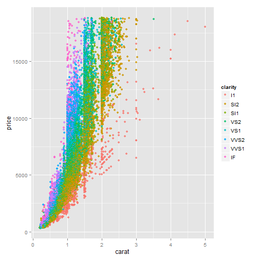
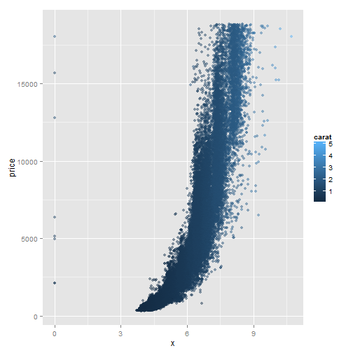
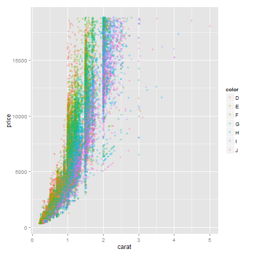
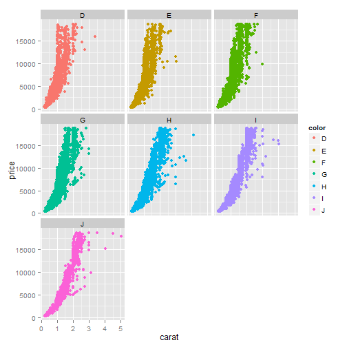

% Hausaufgabe 16
% Anna Rysop <rysop@students.uni-marburg.de>
% 2014-06-14

Falls die Umlaute in dieser und anderen Dateien nicht korrekt dargestellt werden, sollten Sie File > Reopen with Encoding > UTF-8 sofort machen (und auf jeden Fall ohne davor zu speichern), damit die Enkodierung korrekt erkannt wird! 


# Die nächsten Punkte sollten beinahe automatisch sein...
1. Kopieren Sie diese Datei in Ihren Ordner (das können Sie innerhalb RStudio machen oder mit Explorer/Finder/usw.) und öffnen Sie die Kopie. Ab diesem Punkt arbeiten Sie mit der Kopie. Die Kopie bitte `hausaufgabe16.Rmd` nennen und nicht `Kopie...`
2. Sie sehen jetzt im Git-Tab, dass die neue Datei als unbekannt (mit gelbem Fragezeichen) da steht. Geben Sie Git Bescheid, dass Sie die Änderungen in der Datei verfolgen möchten (auf Stage klicken).
3. Machen Sie ein Commit mit den bisherigen Änderungen (schreiben Sie eine sinnvolle Message dazu -- sinnvoll bedeutet nicht unbedingt lang) und danach einen Push.
4. Ersetzen Sie meinen Namen oben mit Ihrem. Klicken auf Stage, um die Änderung zu merken.
5. Ändern Sie das Datum auf heute. (Seien Sie ehrlich! Ich kann das sowieso am Commit sehen.)
6. Sie sehen jetzt, dass es zwei Symbole in der Status-Spalte gibt, eins für den Zustand im *Staging Area* (auch als *Index* bekannt), eins für den Zustand im Vergleich zum Staging Area. Sie haben die Datei modifiziert, eine Änderung in das Staging Area aufgenommen, und danach weitere Änderungen gemacht. Nur Änderungen im Staging Area werden in den Commit aufgenommen.
7. Stellen Sie die letzten Änderungen auch ins Staging Area und machen Sie einen Commit (immer mit sinnvoller Message!).
8. Vergessen Sie nicht am Ende, die Lizenz ggf. zu ändern!

# Diamonds are forever 
Bisher haben Sie von mir mehr oder weniger vollständige Analysen bekommen, bei denen Sie im Prinzip nur einzelne Schritte einfügen müssten. Es wird allerdings langsam Zeit, dass Sie eine eigenständige Analyse ausführen. Sie haben das bei der Analyse vom Priming Experiment mittels ANOVA fast gemacht, aber auch da haben Sie viel von mir vorgefertigt bekommen. Für die Aufgaben heute werden Sie den Datensatz `diamonds` aus `ggplot2` bearbeiten. Schauen Sie sich die Beschreibung des Datensatzes an


```r
`?`(diamonds)
```

<div style="border: 2px solid black; padding: 5px; font-size: 80%;">
<!DOCTYPE html PUBLIC "-//W3C//DTD HTML 4.01 Transitional//EN">
<html><head><title>R: Prices of 50,000 round cut diamonds</title>
<meta http-equiv="Content-Type" content="text/html; charset=utf-8">
<link rel="stylesheet" type="text/css" href="">
</head><body>

<table width="100%" summary="page for diamonds"><tr><td>diamonds</td><td align="right">R Documentation</td></tr></table>

<h2>Prices of 50,000 round cut diamonds</h2>

<h3>Description</h3>

<p>A dataset containing the prices and other attributes of
almost 54,000 diamonds. The variables are as follows:
</p>


<h3>Format</h3>

<p>A data frame with 53940 rows and 10 variables</p>


<h3>Details</h3>

 <ul>
<li><p> price. price in US dollars
(\$326&ndash;\$18,823) </p>
</li>
<li><p> carat. weight of the diamond
(0.2&ndash;5.01) </p>
</li>
<li><p> cut. quality of the cut (Fair, Good,
Very Good, Premium, Ideal) </p>
</li>
<li><p> colour. diamond colour,
from J (worst) to D (best) </p>
</li>
<li><p> clarity. a measurement
of how clear the diamond is (I1 (worst), SI1, SI2, VS1,
VS2, VVS1, VVS2, IF (best)) </p>
</li>
<li><p> x. length in mm
(0&ndash;10.74) </p>
</li>
<li><p> y. width in mm (0&ndash;58.9) </p>
</li>
<li><p> z. depth
in mm (0&ndash;31.8) </p>
</li>
<li><p> depth. total depth percentage = z /
mean(x, y) = 2 * z / (x + y) (43&ndash;79) </p>
</li>
<li><p> table. width
of top of diamond relative to widest point (43&ndash;95) </p>
</li></ul>


</body></html>

</div>

Die Aufgabe ist: eine Ausgangsfrage und die darauf folgenden Anschlussfragen statistisch zu beantworten. Sie können auch einige kleinere Fragen als Gruppe behandeln. Sie haben frei Wahl von Methoden und Fragen, aber sie müssen natürlich zueinander passen!

Mögliche Ausgangsfragen sind unter anderem:

* Was bestimmt den Preis eines Diamenten?
* Was bestimmt das Gewicht eines Diamenten? Hat Farbe oder Klarheit eine Auswirkung daruf oder bloß Volumen?
* Gibt es einen Zusammenhang zwischen den verschieden Dimensionen ("Längen")? 
* Gibt es einen Zusammenhang zwischen Farbe und Klarheit? Zwischen Farbe und Carat? Zwischen Farbe und Tiefe?
* ...

# Zusammenhang zwischen Karat und Preis

```r
ggplot(diamonds, aes(x = carat, y = price, color = clarity)) + geom_point(alpha = 0.8)
```

 


Anhand dieser Darstellung sieht man, dass je mehr Karat die Datenpunkte darstellen, preislich ansteigen.Daraus lässt sich ableiten, dass Karat einen Einfluss auf den Preis hat. Dies wird statistisch mittels Regressionsanalyse überprüft.


```r
lm(price ~ carat, data = diamonds)
```

```
## 
## Call:
## lm(formula = price ~ carat, data = diamonds)
## 
## Coefficients:
## (Intercept)        carat  
##       -2256         7756
```

```r
summary(lm(price ~ carat, data = diamonds))
```

```
## 
## Call:
## lm(formula = price ~ carat, data = diamonds)
## 
## Residuals:
##    Min     1Q Median     3Q    Max 
## -18585   -805    -19    537  12732 
## 
## Coefficients:
##             Estimate Std. Error t value Pr(>|t|)    
## (Intercept)  -2256.4       13.1    -173   <2e-16 ***
## carat         7756.4       14.1     551   <2e-16 ***
## ---
## Signif. codes:  0 '***' 0.001 '**' 0.01 '*' 0.05 '.' 0.1 ' ' 1
## 
## Residual standard error: 1550 on 53938 degrees of freedom
## Multiple R-squared:  0.849,	Adjusted R-squared:  0.849 
## F-statistic: 3.04e+05 on 1 and 53938 DF,  p-value: <2e-16
```

R² nimmt den Wert 0.85 an, ist also ziemlich dicht an 1, was heißt, dass viel Varianz erklärt ist. Somit hat Karat einen messbaren Einfluss auf Preis.

# Preis gegen length, width und depth

Auch die Größe scheint einen Einfluss zu haben, da R² 0.78 sind. Der Wert ist jedoch kleiner als der von Karat, was bedeutet, dass die Größe weniger Varianz erklärt als Karat. Den Einfluss kann man auch in der Grafik sehen.

```r
summary(lm(price ~ x, data = diamonds))
```

```
## 
## Call:
## lm(formula = price ~ x, data = diamonds)
## 
## Residuals:
##    Min     1Q Median     3Q    Max 
##  -8426  -1264   -185    973  32128 
## 
## Coefficients:
##              Estimate Std. Error t value Pr(>|t|)    
## (Intercept) -14094.06      41.73    -338   <2e-16 ***
## x             3145.41       7.15     440   <2e-16 ***
## ---
## Signif. codes:  0 '***' 0.001 '**' 0.01 '*' 0.05 '.' 0.1 ' ' 1
## 
## Residual standard error: 1860 on 53938 degrees of freedom
## Multiple R-squared:  0.782,	Adjusted R-squared:  0.782 
## F-statistic: 1.94e+05 on 1 and 53938 DF,  p-value: <2e-16
```

```r
ggplot(diamonds, aes(x = x, y = price, color = carat)) + geom_point(alpha = 0.5)
```

 

Einen ähnlichen Wert nimmt R² bei der linearen Regression von Preis und Breite (width) an, nämlich R²=0.75.

```r
summary(lm(price ~ y, data = diamonds))
```

```
## 
## Call:
## lm(formula = price ~ y, data = diamonds)
## 
## Residuals:
##     Min      1Q  Median      3Q     Max 
## -152436   -1229    -241     838   31436 
## 
## Coefficients:
##              Estimate Std. Error t value Pr(>|t|)    
## (Intercept) -13402.03      44.06    -304   <2e-16 ***
## y             3022.89       7.54     401   <2e-16 ***
## ---
## Signif. codes:  0 '***' 0.001 '**' 0.01 '*' 0.05 '.' 0.1 ' ' 1
## 
## Residual standard error: 2000 on 53938 degrees of freedom
## Multiple R-squared:  0.749,	Adjusted R-squared:  0.749 
## F-statistic: 1.61e+05 on 1 and 53938 DF,  p-value: <2e-16
```

Ebenso verhält es sich mit der Variablen depth (z), auch hier gibt es für R² einen Wert von 0.74, was bedeutet, dass so viel Varianz durch die Variable erklärt wird.

```r
summary(lm(price ~ z, data = diamonds))
```

```
## 
## Call:
## lm(formula = price ~ z, data = diamonds)
## 
## Residuals:
##     Min      1Q  Median      3Q     Max 
## -139561   -1235    -240     825   32085 
## 
## Coefficients:
##             Estimate Std. Error t value Pr(>|t|)    
## (Intercept) -13296.6       44.6    -298   <2e-16 ***
## z             4868.8       12.4     394   <2e-16 ***
## ---
## Signif. codes:  0 '***' 0.001 '**' 0.01 '*' 0.05 '.' 0.1 ' ' 1
## 
## Residual standard error: 2030 on 53938 degrees of freedom
## Multiple R-squared:  0.742,	Adjusted R-squared:  0.742 
## F-statistic: 1.55e+05 on 1 and 53938 DF,  p-value: <2e-16
```


Da es sich bei den Variablen cut, color und clarity um nominalskalierte Daten handelt, kann mit diesen Variablen keine lineare Regression berechnet werden.


*Vergessen Sie dabei nicht, dass wir bisher nur Methoden gelernt haben, wo die abhängige Variable zumindest intervallskaliert ist!*

Sie können sich auch [das *ggplot* Buch](http://dx.doi.org/10.1007/978-0-387-98141-3) zur Inspiration anschauen, v.a. Abbildungen 4.7, 4.8, 4.9, 5.2, 5.3, 5.4, 5.6, 5.14, 7.16, 9.1  und Kapitel 2.2-2.5 könnten inspirierend wirken. Den Code zur Erstellung der Figuren findet man immer im Haupttext.

**Originale Fragestellungen und Auswertungen werden mit Bonuspunkten belohnt!** 

Hier ein paar Grafiken (auch im Buch zu finden):

```r
ggplot(diamonds, aes(x = carat, y = price, color = color)) + geom_point()
```

 

```r
ggplot(diamonds, aes(x = carat, y = price, color = color)) + geom_point(alpha = 0.3)
```

 

```r
ggplot(diamonds, aes(x = carat, y = price, color = color)) + geom_point() + 
    facet_wrap(~color)
```

 


# Noch eine Überlegung
Haben Sie dabei explorativ oder konfirmativ gearbeitet? Was hat das für eine Auswirkung auf die Interpretation der Ergebnisse?

# Lizenz
Dieses Werk ist lizenziert unter einer CC-BY-NC-SA Lizenz.
